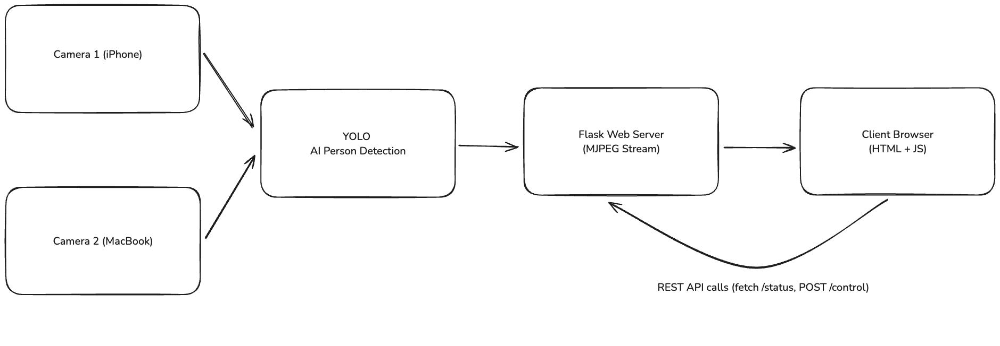

> **IMPORTANT NOTE:** Although the initial plan included GStreamer, it was excluded after repeated compatibility issues on macOS. Instead, we implemented a fully working Flask-based MJPEG streaming system that still delivers the required functionality with real-time AI-powered person detection.

# Multi-Camera Real-Time Person Detection Platform

This project is a real-time, AI-enhanced video analytics and streaming platform. It uses **YOLOv5n** to detect people from two different camera sources and delivers the processed video streams along with detection metrics through a browser-based interface and REST API.

---

## 🎯 Features

- 🧠 **AI-Powered Person Detection** using YOLOv5n
- 📷 **Multi-camera input support** (MacBook webcam & iPhone camera)
- 🧭 **Real-time annotated MJPEG streaming**
- 🌐 **Web interface** with live person counts for each stream
- ⚙️ **REST API** to monitor detection stats and control stream status
- ✅ **Start/stop control** for each camera feed independently
- ⚡ Smooth, flicker-free video by processing every frame

---

## 🧱 Technologies Used

- **Python 3**
- **Flask** (web server & REST API)
- **OpenCV** (video handling, rendering)
- **YOLOv5n** via [Ultralytics](https://github.com/ultralytics/ultralytics) (AI model)
- **HTML + CSS + JavaScript** (browser UI)

---

## 🚀 Installation

> 📌 It’s highly recommended to use a virtual environment

```bash
python3 -m venv venv
source venv/bin/activate
pip install -r requirements.txt
```

---

## ▶️ Running the App

```bash
python app.py
```

Then open your browser and visit:  
**`http://localhost:5050`**

What you'll see:

- Two live camera feeds
- Person counts updating in real time under each stream
- Status endpoint: `http://localhost:5050/status`

Example response:
```json
{
  "status": "Running",
  "people_detected_1": 1,
  "people_detected_2": 2
}
```

You can also start or stop each camera stream dynamically:

```bash
curl -X POST "http://localhost:5050/control?cam=0&action=stop"
curl -X POST "http://localhost:5050/control?cam=1&action=start"
```

---

## 🧠 Notes

- GStreamer was excluded due to continuous failures on macOS (pipeline errors, rendering glitches, device compatibility).
- The MJPEG stream is served directly using Flask’s response generator.
- YOLOv5n (`yolov5n.pt`) must be present in the working directory, or downloaded via Ultralytics hub.

---

## 🖼️ Architecture & Data Flow Diagram



---

## 📂 Project Structure

```
.
├── app.py                 # Main Flask app with AI detection & streaming logic
├── requirements.txt       # All required dependencies
├── architecture_diagram.png  # System flowchart
└── venv/                  # Optional virtual environment folder
```
